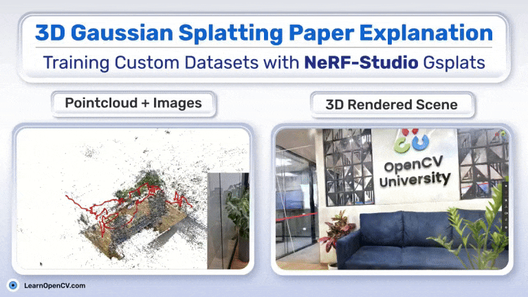

# 3D Gaussian Splatting Paper Explanation: Training Custom Datasets with NeRF-Studio Gsplats

This folder contains the Jupyter Notebooks for the LearnOpenCV article  - **[3D Gaussian Splatting Paper Explanation: Training Custom Datasets with NeRF-Studio Gsplats](https://learnopencv.com/3d-gaussian-splatting/)**.

### We have provided:
* video to image  (`video2imgs.py`)
* create colmap data (`imgs2poses.py`)

### Dataset:
- https://www.dropbox.com/scl/fi/nzrfysxv5sx1h9dn59d3e/garden.zip?rlkey=48f73q7bixqi1jvmowodcpfkf&st=jqigllj9&dl=1
- https://www.dropbox.com/scl/fi/qyrmhw0mbdiucg0vh9834/desk_v2.zip?rlkey=luvjualgu32to1sw61rmyhugc&st=v68qlwvk&dl=1

---

  

<h2 align="center">Build Production-Ready Computer Vision &amp; AI Solutions</h2>

  LearnOpenCV is maintained by <a href="https://bigvision.ai/"><strong>BigVision.AI</strong></a>, a computer vision and AI consulting company. We help organizations design, build, optimize, and deploy production-ready AI solutions. Our team has deep expertise in computer vision, deep learning, multimodal AI, and edge deployment, with experience solving complex technical challenges across industries.

  Have a project in mind? Talk with our expert AI solution builders.

  

