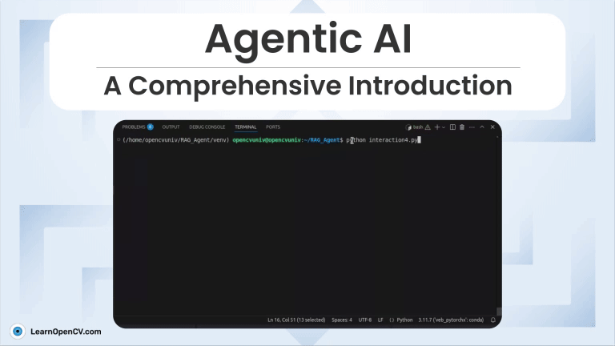

# Agentic-AI

This repository contains two folders, DIrectionX and SmartRetriever to setup the Agentic AI workflow on your local machine. 

Each of them contains various python scripts to execute the implementation of AI Agents using both paid (OpenAI) and free-to-use (Google Gemini) models. 

It is part of the LearnOpenCV blog post - [Agentic-AI-A-Comprehensive-Introduction](https://learnopencv.com/agentic-ai/).

---

  

<h2 align="center">Build Production-Ready Computer Vision &amp; AI Solutions</h2>

  LearnOpenCV is maintained by <a href="https://bigvision.ai/"><strong>BigVision.AI</strong></a>, a computer vision and AI consulting company. We help organizations design, build, optimize, and deploy production-ready AI solutions. Our team has deep expertise in computer vision, deep learning, multimodal AI, and edge deployment, with experience solving complex technical challenges across industries.

  Have a project in mind? Talk with our expert AI solution builders.

  

