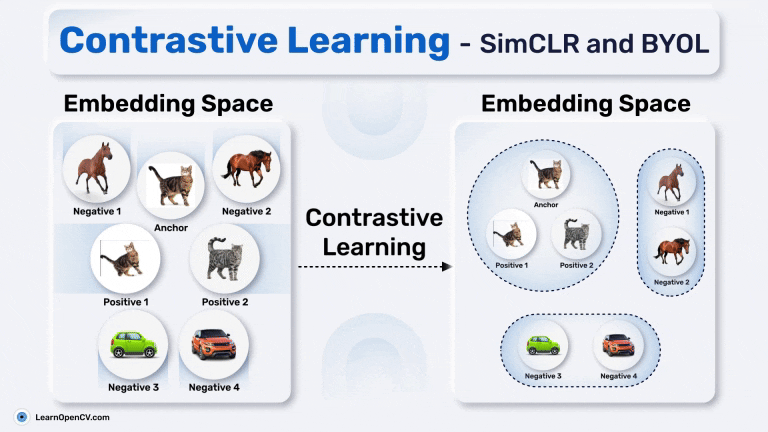

# Contrastive Learning : SimCLR and BYOL (With Code Example)

This repository contains BYOL (Bootstrap Your Own Latent) pretraining implementation code on CIFAR-10 dataset and also the code for fine-tuning BYOL's learned representations on STL-10 dataset.

It is part of the LearnOpenCV blog post - [Contrastive Learning : SimCLR and BYOL (With Code Example)](https://learnopencv.com/contrastive-learning-simclr-and-byol-with-code-example/).

## How to Execute?

Execute the ``BYOL_implementation_in_Pytorch.ipynb`` notebook for pretraining the BYOL. And then execute the  ``Linear_Feature_Eval_Raw.ipynb`` notebook for testing the fine-tuning purpose for downstream tasks.

---

  

<h2 align="center">Build Production-Ready Computer Vision &amp; AI Solutions</h2>

  LearnOpenCV is maintained by <a href="https://bigvision.ai/"><strong>BigVision.AI</strong></a>, a computer vision and AI consulting company. We help organizations design, build, optimize, and deploy production-ready AI solutions. Our team has deep expertise in computer vision, deep learning, multimodal AI, and edge deployment, with experience solving complex technical challenges across industries.

  Have a project in mind? Talk with our expert AI solution builders.

  

