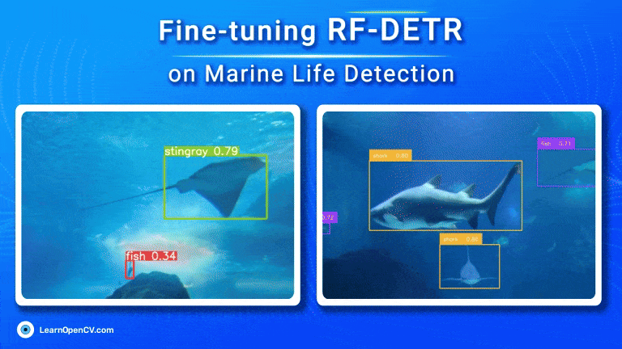

# Fine-tuning RF-DETR  

This repository contains a checkpoint directory and a scripts directory. Checkpoint directory includes checkpoints of fine-tuned RF-DETR model, fine-tuned on aquatic dataset containing a total of 7 classes. Scripts directory contains two .py files, 

1. yolo_to_coco.py: this script is used to convert YOLO format dataset into COCO format.
2. inferencing_with_RFDETR.py: this script is used to perform inferencing on RF-DETR.

This is a part of the LearnOpenCV blog post - [Fine-tuning RF-DETR](https://learnopencv.com/rf-detr-object-detection/).

- To download the finetuned model checkpoints find the link here: [Ckpt Download](https://www.dropbox.com/scl/fo/dcap29qjjri85c9yghi0r/AH7-Rcdwhy92MzoR9rJtqss?rlkey=tqpe7z0qvx4ngg4gzvr67dt1w&st=qwclgbmd&dl=1)
  

---

  

<h2 align="center">Build Production-Ready Computer Vision &amp; AI Solutions</h2>

  LearnOpenCV is maintained by <a href="https://bigvision.ai/"><strong>BigVision.AI</strong></a>, a computer vision and AI consulting company. We help organizations design, build, optimize, and deploy production-ready AI solutions. Our team has deep expertise in computer vision, deep learning, multimodal AI, and edge deployment, with experience solving complex technical challenges across industries.

  Have a project in mind? Talk with our expert AI solution builders.

  

