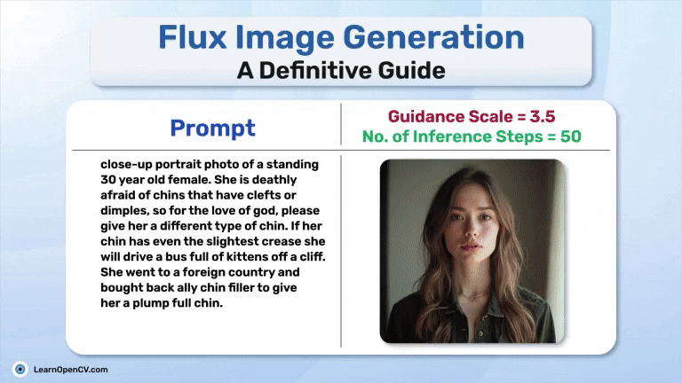

# FLUX Image Generation: Experimenting with the Parameters

This repository contains script files for performing inferencing with Flux.1-Dev. Various use cases have different script files, so just go through them and get an hand-on experience on the problem you are trying to solve.

It is part of LearnOpenCV blog post, so do visit it for better understanding on flux image generations:- [FLUX Image Generation: Experimenting with the Parameters](https://learnopencv.com/flux-ai-image-generator/)

---

  

<h2 align="center">Build Production-Ready Computer Vision &amp; AI Solutions</h2>

  LearnOpenCV is maintained by <a href="https://bigvision.ai/"><strong>BigVision.AI</strong></a>, a computer vision and AI consulting company. We help organizations design, build, optimize, and deploy production-ready AI solutions. Our team has deep expertise in computer vision, deep learning, multimodal AI, and edge deployment, with experience solving complex technical challenges across industries.

  Have a project in mind? Talk with our expert AI solution builders.

  

