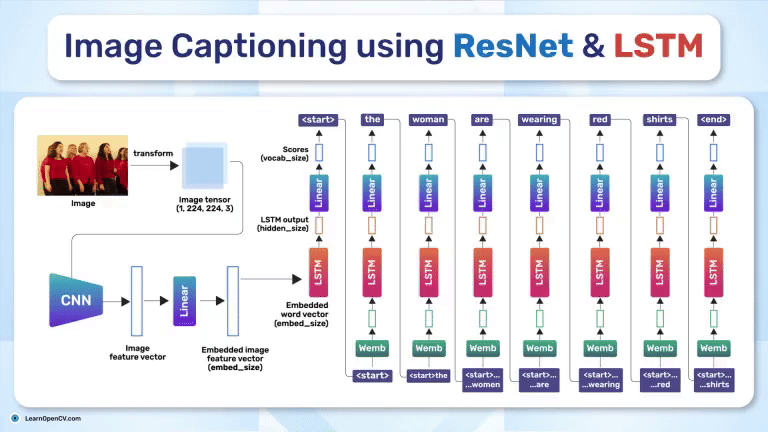

# Image Captioning using ResNet and LSTM

This repository contains the Notebook file to Train the Model and Python script to run the Inference.   

It is part of the LearnOpenCV blog post - [Image Captioning using ResNet and LSTM](https://learnopencv.com/image-captioning/)

### Run Inference

Install the `requirements.txt`file in your python environment.

Run the `train.py` file to train the model.

Run the ``app.py`` file to run the inference.

---

  

<h2 align="center">Build Production-Ready Computer Vision &amp; AI Solutions</h2>

  LearnOpenCV is maintained by <a href="https://bigvision.ai/"><strong>BigVision.AI</strong></a>, a computer vision and AI consulting company. We help organizations design, build, optimize, and deploy production-ready AI solutions. Our team has deep expertise in computer vision, deep learning, multimodal AI, and edge deployment, with experience solving complex technical challenges across industries.

  Have a project in mind? Talk with our expert AI solution builders.

  

