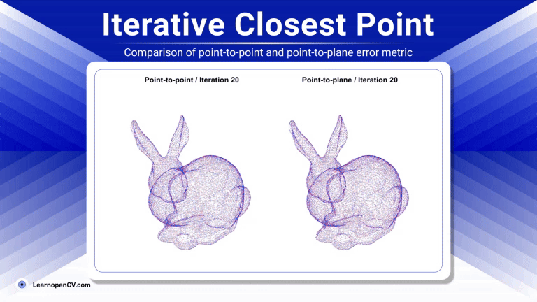

# Understanding Iterative Closest Point (ICP) Algorithm 

**This repository contains inference code for [ Iterative Closest Point (ICP) Algorithm](https://learnopencv.com/iterative-closest-point-icp-explained/) blogpost** 

---

#### Simple Python Implementation

To run,

`python test.py`

#### Using Open3D

1. [ Open3D ICP Registration](https://github.com/isl-org/Open3D/blob/4356c172767a65209d2fe6dd76ff571f10293249/docs/jupyter/pipelines/icp_registration.ipynb#L4)
2. [Introduction to Point Cloud Registration using Open3D](https://medium.com/@amnahhmohammed/gentle-introduction-to-point-cloud-registration-using-open3d-c8503527f421)

---

---

  

<h2 align="center">Build Production-Ready Computer Vision &amp; AI Solutions</h2>

  LearnOpenCV is maintained by <a href="https://bigvision.ai/"><strong>BigVision.AI</strong></a>, a computer vision and AI consulting company. We help organizations design, build, optimize, and deploy production-ready AI solutions. Our team has deep expertise in computer vision, deep learning, multimodal AI, and edge deployment, with experience solving complex technical challenges across industries.

  Have a project in mind? Talk with our expert AI solution builders.

  

