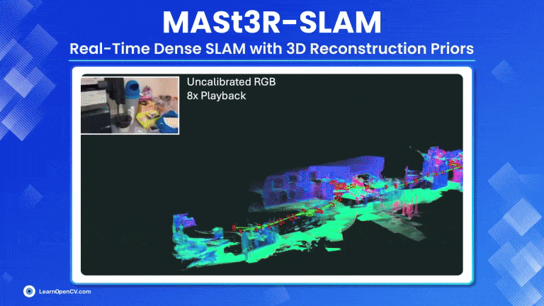

# MASt3R-SLAM: Real-Time Dense SLAM with 3D Reconstruction Priors

This folder contains the instruction to run for the LearnOpenCV article  - **[MASt3R-SLAM Explanation](https://learnopencv.com/mast3r-slam-realtime-dense-slam-explained/)**.



To run:

## **MASt3R-SLAM**

Visit MASt3R-SLAM Repository 

```python
git clone https://github.com/rmurai0610/MASt3R-SLAM.git --recursive
cd MASt3R-SLAM/

# if you've clone the repo without --recursive run
# git submodule update --init --recursive
```

```python
pip install -e thirdparty/mast3r
pip install -e thirdparty/in3d
pip install --no-build-isolation -e .
 

# Optionally install torchcodec for faster mp4 loading
pip install torchcodec==0.1
```

**Download checkpoints**:

```mkdir -p checkpoints/
wget https://download.europe.naverlabs.com/ComputerVision/MASt3R/MASt3R_ViTLarge_BaseDecoder_512_catmlpdpt_metric.pth -P checkpoints/
wget https://download.europe.naverlabs.com/ComputerVision/MASt3R/MASt3R_ViTLarge_BaseDecoder_512_catmlpdpt_metric_retrieval_trainingfree.pth -P checkpoints/
wget https://download.europe.naverlabs.com/ComputerVision/MASt3R/MASt3R_ViTLarge_BaseDecoder_512_catmlpdpt_metric_retrieval_codebook.pkl -P checkpoints/```
```

**Inference on a Image sequence**

````bash ./scripts/download_tum.sh
bash ./scripts/download_tum.sh
python main.py --dataset datasets/tum/rgbd_dataset_freiburg1_room/ --config config/calib.yaml	
````

**Inference on a Video**

It can process either MP4 videos or folders containing RGB images.

```
python main.py --dataset <path/to/video>.mp4 --config config/base.yaml
python main.py --dataset <path/to/folder> --config config/base.yaml
```

---

<p align="center">
  <a href="https://bigvision.ai/">
    
  </a>
</p>

<h2 align="center">Build Production-Ready Computer Vision &amp; AI Solutions</h2>

<p align="center">
  LearnOpenCV is maintained by <a href="https://bigvision.ai/"><strong>BigVision.AI</strong></a>, a computer vision and AI consulting company. We help organizations design, build, optimize, and deploy production-ready AI solutions. Our team has deep expertise in computer vision, deep learning, multimodal AI, and edge deployment, with experience solving complex technical challenges across industries.
</p>

<p align="center">
  Have a project in mind? Talk with our expert AI solution builders.
</p>

<p align="center">
  <a href="https://bigvision.ai/expert-ai-solution-builders?utm_source=locv-github">
    
  </a>
</p>
