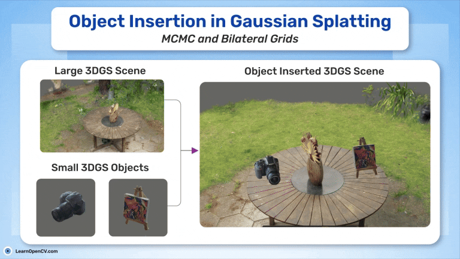

# Object Insertion in Gaussian Splatting: Paper Explanation and Training of MCMC in Gsplat

This folder contains the Jupyter Notebooks and Scripts for the LearnOpenCV article  - **[Object Insertion in Gaussian Splatting: Paper Explanation and Training of MCMC in Gsplat](https://learnopencv.com/object-insertion-in-gaussian-splatting/)**.

### To run:
Follow the instructions from the article.

1. `src/insert_canvas_in_garden.py` : insert canvas ply to garden ply
2. `src/colmap_rerun.py` : Used for Rerun logging 

---

Download the dataset from here:
- [**garden**](http://storage.googleapis.com/gresearch/refraw360/360_v2.zip)
- [**Canvas**](https://www.dropbox.com/scl/fi/2k5xfxpani744dzbxco5h/obj_insert_canvas_data_blog.zip?rlkey=pxwui6w4h7s8ql3eqpxzq51ls&st=8fl2f5f1&dl=1)

You can directly download the code files from the below link.

---

  

<h2 align="center">Build Production-Ready Computer Vision &amp; AI Solutions</h2>

  LearnOpenCV is maintained by <a href="https://bigvision.ai/"><strong>BigVision.AI</strong></a>, a computer vision and AI consulting company. We help organizations design, build, optimize, and deploy production-ready AI solutions. Our team has deep expertise in computer vision, deep learning, multimodal AI, and edge deployment, with experience solving complex technical challenges across industries.

  Have a project in mind? Talk with our expert AI solution builders.

  

