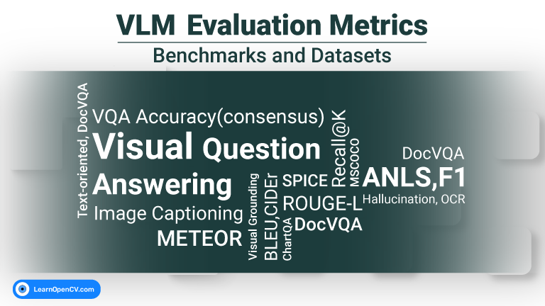

## VLM Evaluation Metrics
This repository contains code for the blog post [Top VLM Evaluation Metrics for Optimal Performance Analysis](https://learnopencv.com/vlm-evaluation-metrics/).
Vision-Language Models (VLMs) are powerful and figuring out how well they actually work is a real challenge. There isn’t one single test that covers everything they can do. Instead, we need to use the right datasets and the right VLM Evaluation Metrics.

---

  

<h2 align="center">Build Production-Ready Computer Vision &amp; AI Solutions</h2>

  LearnOpenCV is maintained by <a href="https://bigvision.ai/"><strong>BigVision.AI</strong></a>, a computer vision and AI consulting company. We help organizations design, build, optimize, and deploy production-ready AI solutions. Our team has deep expertise in computer vision, deep learning, multimodal AI, and edge deployment, with experience solving complex technical challenges across industries.

  Have a project in mind? Talk with our expert AI solution builders.

  

