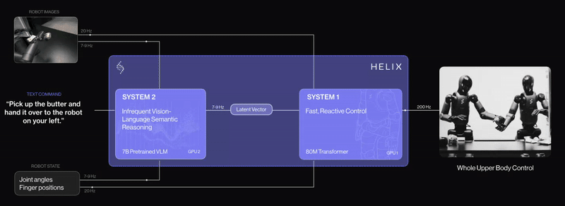

# Vision Language Action Models for Robot Control

**This repository contains inference code for [Vision Language Action Models](https://learnopencv.com/vision-language-action-models-lerobot-policy/) blogpost** 

1. Octo Transformer 
2. Pi-Zero
3. GR00T N1

---

  

<h2 align="center">Build Production-Ready Computer Vision &amp; AI Solutions</h2>

  LearnOpenCV is maintained by <a href="https://bigvision.ai/"><strong>BigVision.AI</strong></a>, a computer vision and AI consulting company. We help organizations design, build, optimize, and deploy production-ready AI solutions. Our team has deep expertise in computer vision, deep learning, multimodal AI, and edge deployment, with experience solving complex technical challenges across industries.

  Have a project in mind? Talk with our expert AI solution builders.

  

