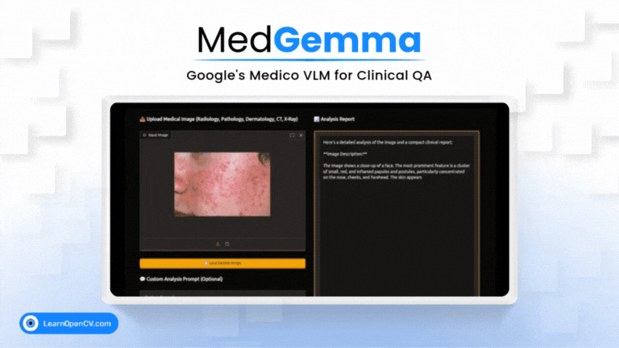

# MedGemma: Google’s Medico VLM for Clinical QA, Imaging, and More

This repository contains the Python scripts to run the Inference.   

It is part of the LearnOpenCV blog post - [MedGemma: Google’s Medico VLM for Clinical QA, Imaging, and More](https://learnopencv.com/medgemma-explained/).

### Run Inference

Install the dependencies with the ``requirements.txt`` file.

Use the ``app.py`` file to run the inference. Alternatively you can run the ``quick_start_with_hugging_face.ipynb`` notebook in **jupyter** or similar environment.

**Note** - The Model and the Code requires a efficient cosumer GPU like **Nvidia GeForce RTX 3070 Ti Laptop GPU** to run the inference.

---

  

<h2 align="center">Build Production-Ready Computer Vision &amp; AI Solutions</h2>

  LearnOpenCV is maintained by <a href="https://bigvision.ai/"><strong>BigVision.AI</strong></a>, a computer vision and AI consulting company. We help organizations design, build, optimize, and deploy production-ready AI solutions. Our team has deep expertise in computer vision, deep learning, multimodal AI, and edge deployment, with experience solving complex technical challenges across industries.

  Have a project in mind? Talk with our expert AI solution builders.

  

