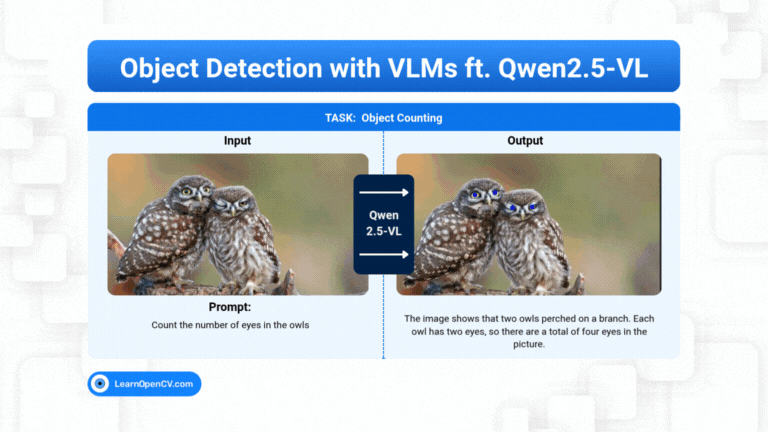

# Object Detection and Spatial Understanding with VLMs ft. Qwen2.5-VL

This repository contains the Python scripts to run the Inference.   

It is part of the LearnOpenCV blog post - [Object Detection and Spatial Understanding with VLMs ft. Qwen2.5-VL](https://learnopencv.com/object-detection-with-vlms-ft-qwen2-5-vl/).

### Run Inference

Run the `qwen.py` for **Qwen 2.5-VL** inference and `app.py` for comparison between **Qwen 2.5-VL** and **Gemma 3** 

**Note** - The Model and the Code requires a efficient consumer GPU like **Nvidia GeForce RTX 3070 Ti Laptop GPU** or **Nvidia Tesla T4** to run the inference. 

### PS: This Fine Tuning requires at least **`> 16 GB`** of **VRAM**.

---

  

<h2 align="center">Build Production-Ready Computer Vision &amp; AI Solutions</h2>

  LearnOpenCV is maintained by <a href="https://bigvision.ai/"><strong>BigVision.AI</strong></a>, a computer vision and AI consulting company. We help organizations design, build, optimize, and deploy production-ready AI solutions. Our team has deep expertise in computer vision, deep learning, multimodal AI, and edge deployment, with experience solving complex technical challenges across industries.

  Have a project in mind? Talk with our expert AI solution builders.

  

