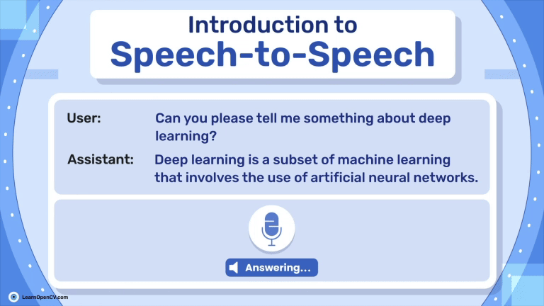

## Introduction to Speech to Speech: Most Efficient Form of NLP

This repository contains the Notebook file and Python scripts to run the Inference.   

It is part of the LearnOpenCV blog post - [Introduction to Speech to Speech: Most Efficient Form of NLP](https://learnopencv.com/speech-to-speech/)

[]()



### Run Inference

##### Clone the **speech to speech** repository into your local directory:
```bash
git clone https://github.com/huggingface/Speech to Speech.git
cd Speech to Speech
```
##### Follow the Environment setup process described in article.

##### Run the ``pipeline`` in your python environment:
```bash
python s2s_pipeline.py  --recv_host 0.0.0.0  --send_host 0.0.0.0  --lm_model_name meta-llama/Llama-3.2-1B-Instruct --stt_compile_mode reduce-overhead  --tts_compile_mode reduce-overhead
```
##### Then start the ``client``:
```bash
python listen_and_play.py --localhost
```

---

<p align="center">
  <a href="https://bigvision.ai/">
    
  </a>
</p>

<h2 align="center">Build Production-Ready Computer Vision &amp; AI Solutions</h2>

<p align="center">
  LearnOpenCV is maintained by <a href="https://bigvision.ai/"><strong>BigVision.AI</strong></a>, a computer vision and AI consulting company. We help organizations design, build, optimize, and deploy production-ready AI solutions. Our team has deep expertise in computer vision, deep learning, multimodal AI, and edge deployment, with experience solving complex technical challenges across industries.
</p>

<p align="center">
  Have a project in mind? Talk with our expert AI solution builders.
</p>

<p align="center">
  <a href="https://bigvision.ai/expert-ai-solution-builders?utm_source=locv-github">
    
  </a>
</p>
