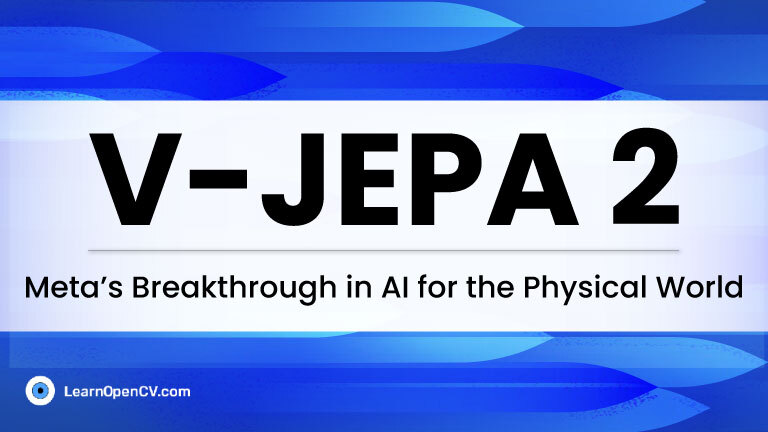

# V-JEPA 2: Meta's Breakthrough in AI for the Physical World

This repository contains the script to perform inferencing on V-JEPA 2, a world model for AI Planning and Robotics . This is a part of the LearnOpenCV blog post - [V-JEPA 2: Meta's Breakthrough in AI for the Physical World](https://learnopencv.com/v-jepa-2-meta-world-model-robotics-guide/).

---

  

<h2 align="center">Build Production-Ready Computer Vision &amp; AI Solutions</h2>

  LearnOpenCV is maintained by <a href="https://bigvision.ai/"><strong>BigVision.AI</strong></a>, a computer vision and AI consulting company. We help organizations design, build, optimize, and deploy production-ready AI solutions. Our team has deep expertise in computer vision, deep learning, multimodal AI, and edge deployment, with experience solving complex technical challenges across industries.

  Have a project in mind? Talk with our expert AI solution builders.

  

